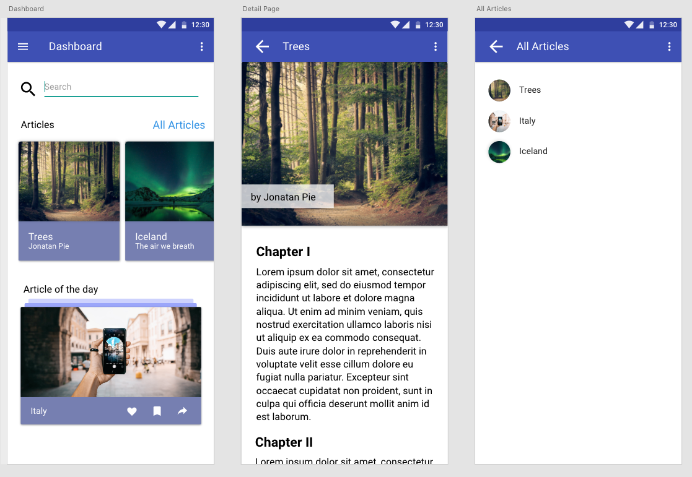

# Chingu Solo Project - Tier 1 - Flutter Project - Blog UI

## Overview

This project provides you with great practice making a modern looking 
mobile application by cloning the provided Template!

This template is reproducible in pure Flutter and uses the Google
Material Design to make the first steps in Flutter as smooth as possible.

## Instructions

For this project you must use the Dart Language and the Flutter Framework.
You are encouraged to use Animations, Media Queries and all other possibilities of Flutter.

General instructions for all Pre-Work Projects can be also found in the [Chingu Library](https://docs.chingu.io/voyage/soloproj/choose/#solo-project-specifications)

### For Beginners in Dart and Flutter

Flutter main programming language is Dart. Dart is a programming language from Google primarily focused on performance and UI design so it is perfect for Flutter development. If you have never worked with Dart, I would recommend you to take a look into the following resources.

- [How to install Dart](https://dart.dev/get-dart)

- [Dart Language Tour](https://dart.dev/guides/language/language-tour)

- [Excersim - Learn Dart the practical way](https://exercism.io/tracks/dart)

### Requirements

*Structure*

- [ ] Explore the [Template] and download the picture on your computer.
- [ ] Make sure to install the Flutter Framework as explained [here](https://flutter.dev/docs/get-started/install)
- [ ] Setup your Editor with the guide [here](https://flutter.dev/docs/get-started/editor)
- [ ] Create a dart file for each screen
- [ ] Use the material widgets from the Flutter Framework and replicate the screens

*Style*

- [ ] Cloning means to create a mobile application with a layout as identical as possible to the template.
  Fonts, colors, and images are not important. The layout of the template
  on the other hand should be the same. A suggestion would be to compare
  the way the template looks face to face to the clone.
- [ ] Choose some images for your template sections at [Unsplash](https://unsplash.com/) 
  or another free image/video site
- [ ] Which fonts and colors do you want to use? Add these colors to your Theme, you have to overwrite a basic theme with the .copyWith() function

*Functionality*

- [ ] Make every article in the dashboard navigate to the Detail Page. 
- [ ] On click "All Articles" navigate to the All Articles Screen.
- [ ] Articles on the Dashboard Screen should be Scrollable

*Other*

- [ ] Your repo needs to have a robust `README.md`
- [ ] Make sure that there are no errors in the developer console before submitting

### Extras (Optional)

- [ ] Make your design fully responsive *check for different Screen Sizes on different devices*
- [ ] Anticipate and handle edge cases
- [ ] Use Accessibility techniques (i.e. a11ly) to improve your app for users with impairments 
- [ ] Add a `CONTRIBUTING.md` file with instructions on how to contribute to your project
- [ ] Try create a [Flutter Web App](https://flutter.dev/docs/get-started/web)
